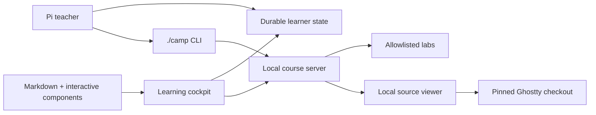

# Product and experience design

## 1. Product definition

Learn Ghostty is not just documentation and not an embedded AI chat application. It is a **local learning cockpit** designed around two cooperating interfaces:

- A browser provides the visual, structured curriculum.
- Pi provides a conversational teacher with direct access to the course and pinned Ghostty source.

A shared, durable progress model connects them. The Pi session is never the only source of memory.



## 2. Daily workflow

### Start

The learner runs:

```console
cd ~/learn-ghostty
pi
```

and asks naturally:

> What's next?

Pi should:

1. Read machine-readable progress and the human-readable journal.
2. Inspect the active lesson and recent lab results.
3. Check whether the local site is running and start it if necessary.
4. Open the current lesson in the browser.
5. Give a short reorientation.
6. Begin with a recall or prediction question rather than a lecture.

Example:

> You are on Day 3, Lesson 4: CSI dispatch. Last time you completed the parser state-machine visualizer and stopped at parameter accumulation. Your open question was why a transition can produce three actions. I opened the lesson. Before continuing: why might one byte require an exit, transition, and entry action?

### Learn

In the browser, the learner can:

- read friendly explanations;
- inspect persistent big-picture diagrams;
- step through animated byte and state transitions;
- run browser-native examples immediately;
- run allowlisted C, Zig, OpenGL, or GTK labs locally;
- make predictions before revealing results;
- follow ordered source trails into Ghostty;
- open exact files and lines in VS Code;
- save notes and questions;
- see course completion separately from demonstrated mastery.

### Ask

When an explanation is insufficient, the learner returns to Pi and asks naturally. The site provides “Copy question for Pi” buttons that include lesson and visualizer context. The course intentionally does **not** embed a second AI chat because that would fragment history and duplicate the teacher interface.

Pi can explain, quiz, trace production code, investigate a seeded bug, or update the course material when a useful explanation is missing.

### Finish and resume

At the end, the learner says:

> Wrap up.

Pi records:

- where the learner stopped;
- what they demonstrated;
- what remains uncertain;
- lab and explain-back outcomes;
- the exact first action for next time.

A new Pi session can resume solely from repository state.

## 3. Dashboard

The dashboard should answer immediately:

1. Where am I?
2. What did I learn?
3. What should I do next?
4. Which parts of Ghostty do I understand?

It includes:

- current lesson and estimated time;
- overall course completion;
- demonstrated mastery;
- recent activity;
- open questions;
- review cards due;
- clickable architecture mastery map;
- one-click resume.

## 4. Progress views

### Timeline

Lessons are shown as not started, in progress, lab passed, explain-back passed, completed, or elective.

### Architecture map

A clickable whole-system map links concepts to production source. Nodes gain detail and color as understanding grows—an architecture “fog of war.”

### Dependency graph

Shows conceptual prerequisites, for example:

```text
bytes and PTYs
  └─ VT parsing
      └─ terminal state
          ├─ rendering
          ├─ selection
          └─ search
```

## 5. Lesson page

A lesson combines:

- course navigation;
- approachable narrative;
- current-layer highlight in the whole stack;
- diagrams and interactive components;
- embedded lab console;
- progress and source trail;
- notes and parked questions;
- official references;
- “Copy question for Pi.”

Reusable interactive components should include:

- `ByteSequence` — printable, escaped, and hexadecimal byte forms;
- `ParserStepper` — one-byte-at-a-time parser transitions;
- `TerminalGrid` — cells, cursor, wrapping, and scrollback;
- `ThreadTimeline` — mailbox, lock, and wakeup activity;
- `MemoryOwnership` — allocations, owners, and lifetimes;
- `GlyphPipeline` — code point to shaped glyph and atlas;
- `GPUFrame` — passes, pipelines, buffers, and shaders;
- `SourceTrail` — execution-ordered source references;
- `Prediction` — predict before reveal;
- `RunnableLab` — safe local execution;
- `ExplainBack` — answer and assessment;
- `QuestionParkingLot` — durable questions;
- `CompareImplementations` — toy code beside Ghostty.

## 6. Learning outcomes

By the end of the camp, the learner should be able to:

- explain the evolution from physical terminal to PTY and modern emulator;
- trace output from child process bytes to displayed pixels;
- trace keyboard input from native event to bytes written to a PTY;
- identify major Ghostty components, ownership boundaries, and threads;
- navigate the Zig core and native runtime boundaries;
- run focused tests and build useful reproductions;
- diagnose and fix small bugs in every major subsystem with appropriate tests;
- explain their changes without depending on an agent.

## 7. Honest scope

Two weeks bootstrap broad understanding; they do not manufacture top-maintainer judgment. A post-camp rotation continues through parser/state, fonts, renderer, input, GTK, macOS, and performance work. The long-term goal is contribution and review fluency, not superficial course completion.
