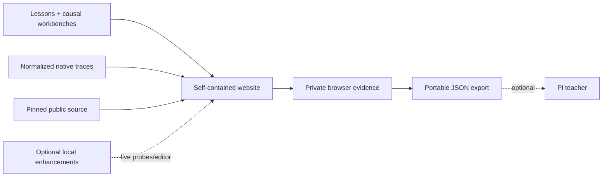

# Product and experience design

## 1. Product definition

Learn Ghostty is a **self-contained learning website**, not merely documentation and not an embedded AI chat application. The browser provides the full curriculum, causal workbenches, reference traces, pinned source, evidence notebook, resume state, and export.

Pi is an optional teacher. The learner may copy a claim or source reference into Pi for adversarial questioning, but navigation, experiments, persistence, and completion never depend on an agent or local process.



## 2. Daily workflow

### Start

The learner opens `https://b1tank.github.io/learn-ghostty/`. The dashboard reads private browser evidence and resumes the exact mission and section. No setup step exists in the learner journey.

If the learner wants dialogue, they copy evidence or a source reference into Pi. Pi starts with a recall or prediction question and never claims to know browser state that was not pasted or exported.

### Learn

In the browser, the learner can:

- read friendly explanations;
- inspect persistent big-picture diagrams;
- step through animated byte and state transitions;
- run browser-native examples immediately;
- analyze normalized traces from real checked-in native probes, with optional live execution detected automatically;
- make predictions before revealing results;
- follow ordered source trails into Ghostty;
- inspect exact files and lines in pinned public source;
- save and export mission evidence;
- see evidence stages rather than percentages.

### Ask

When an explanation is insufficient, the learner returns to Pi and asks naturally. The site provides “Copy question for Pi” buttons that include lesson and visualizer context. The course intentionally does **not** embed a second AI chat because that would fragment history and duplicate the teacher interface.

Pi can explain, quiz, trace production code, investigate a seeded bug, or update the course material when a useful explanation is missing.

### Finish and resume

The website saves mission evidence and the exact next mission in browser storage. The dashboard resumes without an agent. The learner can export a portable JSON record for backup or optional Pi review.

## 3. Dashboard

The homepage serves two states without becoming an LMS dashboard.

For a first-time visitor it immediately explains what the site is, who it serves, how to use it, what the complete path covers, and one obvious Start learning action. It prominently calls out real humans preparing to contribute responsibly to the Ghostty ecosystem.

For a returning learner it adds a concise Welcome back card with the last lesson, last automatically tracked section, and one-click Resume. The full roadmap remains visible in both states; every published lesson is clickable regardless of prerequisites.

Progress is intentionally simple: automatic last-section tracking, explicit Mark lesson complete, browser-local notebook answers, export, and confirmed Restart progress. No percentages or subjective mastery score appear.

## 4. Roadmap and progress

The homepage roadmap is canonical and generated from the module → lesson → mission model. It shows completed, current, available, and planned lessons while treating prerequisites as recommendations rather than locks.

### Architecture map

A clickable whole-system map links concepts to production source. Nodes gain detail and color as understanding grows—an architecture “fog of war.”

### Dependency graph

Shows conceptual prerequisites, for example:

```text
bytes and PTYs
  └─ VT parsing
      └─ terminal state
          ├─ rendering
          ├─ selection
          └─ search
```

## 5. Lesson page

A lesson combines one or more missions. Each mission begins with a mystery or prediction, runs an observable system, builds or manipulates a small causal model, follows a narrow production source trail, and may save learner-authored evidence. Narrative and diagrams exist to explain evidence, not replace it.

Every lesson has breadcrumbs, lesson position, Back to roadmap, previous/next published lesson, explicit completion, automatic section resume, and a sticky vendor-neutral Copy for AI menu. The default copy action includes the current section as clean Markdown plus URL, compact progress, pinned source references, `~/learn-ghostty` and `~/ghostty` paths, and an empty question field. Notes are opt-in.

Reusable interactive components should include:

- `ByteSequence` — printable, escaped, and hexadecimal byte forms;
- `ParserStepper` — one-byte-at-a-time parser transitions;
- `TerminalGrid` — cells, cursor, wrapping, and scrollback;
- `ThreadTimeline` — mailbox, lock, and wakeup activity;
- `MemoryOwnership` — allocations, owners, and lifetimes;
- `GlyphPipeline` — code point to shaped glyph and atlas;
- `GPUFrame` — passes, pipelines, buffers, and shaders;
- `SourceTrail` — execution-ordered source references;
- `Prediction` — predict before reveal;
- `RunnableLab` — safe local execution;
- `ExplainBack` — answer and assessment;
- `QuestionParkingLot` — durable questions;
- `CompareImplementations` — toy code beside Ghostty.

## 6. Learning outcomes

By the end of the camp, the learner should be able to:

- explain the evolution from physical terminal to PTY and modern emulator;
- trace output from child process bytes to displayed pixels;
- trace keyboard input from native event to bytes written to a PTY;
- identify major Ghostty components, ownership boundaries, and threads;
- navigate the Zig core and native runtime boundaries;
- run focused tests and build useful reproductions;
- diagnose and fix small bugs in every major subsystem with appropriate tests;
- explain their changes without depending on an agent.

## 7. Honest scope

Two weeks bootstrap broad understanding; they do not manufacture top-maintainer judgment. A post-camp rotation continues through parser/state, fonts, renderer, input, GTK, macOS, and performance work. The long-term goal is contribution and review fluency, not superficial course completion.
