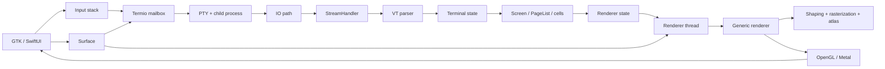

# System design

## 1. Repository shape

```text
learn-ghostty/
├── README.md
├── AGENTS.md
├── ghostty/                         # pinned upstream submodule
├── camp                             # one course command
├── course/
│   ├── manifest.yml
│   ├── source-map.yml
│   └── progress.example.json
├── learner/
│   ├── state.json
│   ├── journal.md
│   ├── questions.md
│   ├── explain-backs/
│   └── lab-results/
├── docs/                            # product and design documents
├── lessons/
│   ├── 00-orientation/
│   ├── 01-terminal-foundations/
│   ├── 02-pty-and-processes/
│   ├── 03-zig-for-ghostty/
│   ├── 04-vt-parser/
│   ├── 05-terminal-state/
│   ├── 06-threads-and-io/
│   ├── 07-unicode-and-fonts/
│   ├── 08-gpu-rendering/
│   ├── 09-input-stack/
│   ├── 10-application-runtime/
│   ├── 11-gtk/
│   ├── 12-macos/
│   ├── 13-advanced-protocols/
│   ├── 14-testing-and-performance/
│   └── 15-contribution-capstones/
├── labs/
│   ├── c/
│   ├── zig/
│   ├── opengl/
│   ├── gtk/
│   ├── swift/
│   └── seeded-bugs/
├── site/                            # VitePress/Vue learning cockpit
│   ├── .vitepress/
│   └── components/
├── visualizers/
│   ├── byte-stream/
│   ├── vt-parser/
│   ├── grid-and-scrollback/
│   ├── thread-timeline/
│   ├── glyph-atlas/
│   ├── gpu-frame/
│   └── architecture-explorer/
├── diagrams/
│   ├── source/
│   └── generated/
├── scripts/
│   ├── doctor
│   ├── verify-source-links
│   ├── generate-diagrams
│   ├── serve
│   └── check-progress
├── .agents/skills/learn-ghostty/
├── .pi/prompts/
└── .pi/extensions/                 # optional course polish
```

## 2. Technology choices

Preferred initial stack:

- VitePress for Markdown, navigation, search, and polished documentation.
- Vue for interactive components and dashboard state.
- Mermaid for maintainable diagrams.
- Canvas/SVG for parser, grid, thread, and atlas visualizers.
- WebGL for GPU-rendering lessons.
- A small Node local service for APIs.
- JSON and Markdown for durable learner state.
- Zig build projects for isolated native labs.

The prototype should minimize dependencies and work offline after initial setup.

## 3. Course server responsibilities

The server exposes only narrow local capabilities:

- serve the site;
- read and update learner progress;
- run commands declared in the course manifest;
- stream bounded lab output;
- read source under the pinned Ghostty checkout;
- resolve symbols and line ranges;
- open validated files in VS Code;
- report health and toolchain versions.

It does not provide arbitrary command execution.

Example allowlisted lab declaration:

```yaml
labs:
  vt-03:
    cwd: labs/zig/vt-parser
    run: [zig, build, run]
    check: [zig, build, test]
    timeout_seconds: 30
```

Security rules:

- validate all paths stay under approved roots;
- validate source line values as integers;
- never interpolate browser text into a shell;
- spawn commands as argument arrays;
- cap output, duration, and concurrent processes;
- bind to loopback only;
- reject unknown lab IDs and actions.

## 4. Source navigation

Each source reference supplies:

```text
Parser.next
src/terminal/Parser.zig

[View here] [Open in VS Code] [Copy path for Pi] [Pinned GitHub]
```

### Browser source view

A route such as:

```text
/source/src/terminal/Parser.zig?line=247&end=290
```

shows syntax-highlighted context, symbols, source-trail navigation, and the pinned commit.

### VS Code

A validated local endpoint executes the equivalent of:

```console
code --goto ~/learn-ghostty/ghostty/src/terminal/Parser.zig:247
```

### Pi reference

Copy a stable prompt-friendly reference:

```text
@ghostty/src/terminal/Parser.zig:247
```

### Link validation

CI and local checks verify:

- the submodule commit matches the manifest;
- referenced files exist;
- named symbols remain discoverable;
- immutable GitHub links use the pin;
- lesson-to-source trails are complete.

## 5. Two kinds of runnable lab

### Browser-native

Immediate, deterministic experiments for:

- byte decoding;
- VT parser states;
- grid mutation and scrollback;
- Unicode and grapheme behavior;
- glyph-atlas packing;
- thread scheduling simulations;
- input encoding;
- WebGL rendering.

### Native

Server-run, allowlisted projects for:

- C PTY launcher;
- Zig parser and terminal state;
- libghostty-vt examples;
- mailbox and concurrency experiments;
- OpenGL cell renderer;
- GTK surface;
- Swift/C bridge where available.

The UI offers Run, Test, Reset, Show Diff, and Open in Editor. A prediction component should often gate Run or Reveal.

## 6. Durable progress

Machine-readable state records current lesson, step, lesson status, labs, explain-backs, confidence, and review schedule.

Human-readable files record:

- where the learner stopped;
- what they can explain;
- current confusion;
- unresolved questions;
- exact next action.

The learner state is the bridge among browser sessions, Pi sessions, and Git history. Browser and Pi updates should be atomic. The server should validate state against a schema.

## 7. Progress semantics

Keep two distinct dimensions:

- **Completion:** content traversed and required interactions performed.
- **Mastery:** labs, explain-backs, transfer questions, and later recall.

Confidence is learner-reported and must not substitute for demonstrated mastery.

Lesson states:

```text
not_started → in_progress → lab_passed → explain_back_passed → completed
```

Some lessons may not require every intermediate state. Electives are separate from the core percentage.

## 8. Course CLI

```console
./camp doctor
./camp status
./camp status --json
./camp next
./camp open
./camp open vt-03
./camp run vt-03
./camp check vt-03
./camp refs vt-03
./camp serve
./camp stop
./camp reset seeded-parser-01
```

The browser and Pi should call the same underlying course API/commands rather than duplicating logic.

## 9. Visual material inventory

The complete course should include at least:

- one interactive whole-system architecture map;
- eight animated sequence diagrams;
- one byte-stream decoder;
- one VT parser stepper;
- one screen/page/scrollback explorer;
- one terminal thread timeline;
- one Unicode/grapheme/glyph explorer;
- one glyph-atlas explorer;
- one GPU frame/pass explorer;
- one input decision tree;
- GTK and macOS lifecycle comparisons;
- 25–35 smaller text-generated diagrams.

Visual sources must be text-based and regenerable. Generated SVGs are artifacts, not opaque sources.

## 10. Architecture poster

The first major visual artifact is an interactive form of:



Clicking a node reveals purpose, history, owning thread, important types, source files, tests, incoming/outgoing data, and recommended lesson.
